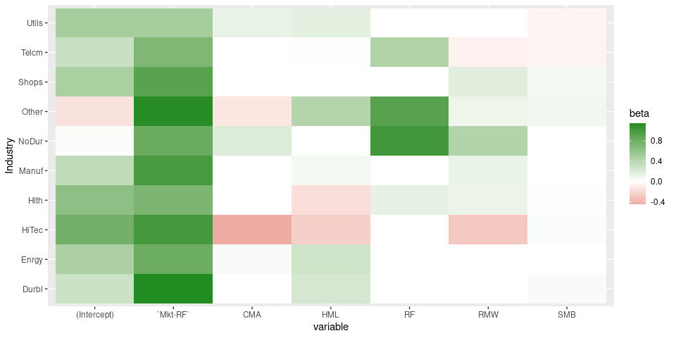
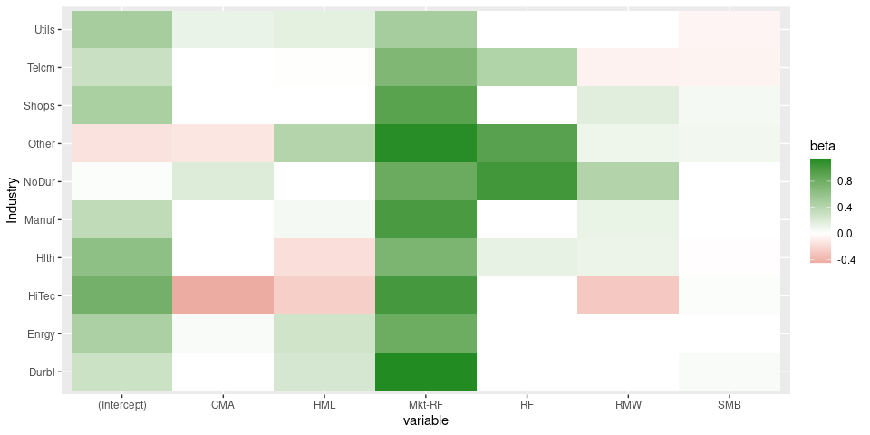

<!-- README.md is generated from README.Rmd. Please edit that file -->

# tidyfit 

<!-- badges: start -->
<!-- badges: end -->

`tidyfit` is an `R`-package that facilitates and automates linear
regression and classification modeling in a tidy environment. The
package includes several methods, such as Lasso, PLS and ElasticNet
regressions. `tidyfit` builds on the `tidymodels` suite, but emphasizes
automated modeling with a focus on the linear regression and
classification coefficients, which are the primary output of `tidyfit`.
The objective is to make model fitting, cross validation and model
output very simple and standardized across all methods, with the
necessary method-specific transformations handled in the background.

## Installation

You can install the development version of tidyfit from
[GitHub](https://github.com/) with:

``` r
# install.packages("devtools")
devtools::install_github("jpfitzinger/tidyfit")
```

## Overview

`tidyfit` includes 4 deceptively simple functions:

-   `regress()`
-   `classify()`
-   `m()`
-   `cross_prod()`

`regress` and `classify` perform regression and classification on tidy
data. The functions ingest a tibble, prepare input data for the models
by splitting groups, partitioning cross validation slices and handling
any necessary adjustments and transformations. The data is then passed
to the model wrapper `m()` which fits the models:

``` r
regress(
  .data, 
  formula = y ~ x1 + x2, 
  mod1 = m(<args for underlying method>), mod2 = m(), ...,    # Pass multiple model wrappers
  .cv = "vfold", .cv_args = list(), .weights = "weight_col",  # Additional settings
  <some additional arguments>)
)
```

The syntax is identical for `classify`.

`m` is a powerful wrapper for many different regression and
classification techniques that can be used with `regress` and
`classify`, or stand-alone:

``` r
m(
  <method>,           # e.g. "lm" or "lasso"
  x, y,               # not passed when used within regress or classify
  ...                 # Args passed to underlying method, e.g. stats::lm or glmnet::glmnet
)
```

An important feature of `m()` is that all arguments can be passed as
vectors, allowing generalized hyperparameter tuning or scenario analysis
for any method:

-   Passing a hyperparameter grid:
    `m("lasso", lambda = seq(0, 1, by = 0.1))`
-   Different algorithms for robust regression:
    `m("robust", method = c("M", "MM"))`
-   Logit and Probit models:
    `m("glm", family = list(binomial(link="logit"), binomial(link="probit")))`

`m()` performs **feature standardization** whenever necessary, it
**always includes an intercept** and outputs regression coefficients and
additional model information in a tidy format with **statistically
comparable results** across all methods.

Finally, predictions are produced using `cross_prod(<fit>, <data>)`. The
function takes data groups, different models, different model settings,
as well as the response family into account and produces predicted
values.

`tidyfit` integrates with `tidymodels`. It uses `dials` to set sensible
default hyperparameter grids, it uses `rsample` for cross validation and
the prediction results can easily be evaluated using `yardstick`.

## Methods implemented in `tidyfit`

<table class="table table-striped" style="margin-left: auto; margin-right: auto;">
<thead>
<tr>
<th style="text-align:left;">
Method
</th>
<th style="text-align:center;">
Name
</th>
<th style="text-align:center;">
Package
</th>
<th style="text-align:center;">
Regression
</th>
<th style="text-align:center;">
Classification
</th>
</tr>
</thead>
<tbody>
<tr>
<td style="text-align:left;">
OLS
</td>
<td style="text-align:center;">
lm
</td>
<td style="text-align:center;">
`stats::lm`
</td>
<td style="text-align:center;">
yes
</td>
<td style="text-align:center;">
no
</td>
</tr>
<tr>
<td style="text-align:left;">
Generalized least squares
</td>
<td style="text-align:center;">
glm
</td>
<td style="text-align:center;">
`stats::glm`
</td>
<td style="text-align:center;">
yes
</td>
<td style="text-align:center;">
yes
</td>
</tr>
<tr>
<td style="text-align:left;">
Robust regression (e.g. Huber loss)
</td>
<td style="text-align:center;">
robust
</td>
<td style="text-align:center;">
`MASS::rlm`
</td>
<td style="text-align:center;">
yes
</td>
<td style="text-align:center;">
no
</td>
</tr>
<tr>
<td style="text-align:left;">
Quantile regression
</td>
<td style="text-align:center;">
quantile
</td>
<td style="text-align:center;">
`quantreg`
</td>
<td style="text-align:center;">
yes
</td>
<td style="text-align:center;">
no
</td>
</tr>
<tr>
<td style="text-align:left;">
LASSO
</td>
<td style="text-align:center;">
lasso
</td>
<td style="text-align:center;">
`glmnet`
</td>
<td style="text-align:center;">
yes
</td>
<td style="text-align:center;">
yes
</td>
</tr>
<tr>
<td style="text-align:left;">
Ridge
</td>
<td style="text-align:center;">
ridge
</td>
<td style="text-align:center;">
`glmnet`
</td>
<td style="text-align:center;">
yes
</td>
<td style="text-align:center;">
yes
</td>
</tr>
<tr>
<td style="text-align:left;">
Adaptive LASSO
</td>
<td style="text-align:center;">
adalasso
</td>
<td style="text-align:center;">
`glmnet`
</td>
<td style="text-align:center;">
yes
</td>
<td style="text-align:center;">
yes
</td>
</tr>
<tr>
<td style="text-align:left;">
ElasticNet
</td>
<td style="text-align:center;">
enet
</td>
<td style="text-align:center;">
`glmnet`
</td>
<td style="text-align:center;">
yes
</td>
<td style="text-align:center;">
yes
</td>
</tr>
<tr>
<td style="text-align:left;">
Gradient boosting regression
</td>
<td style="text-align:center;">
boost
</td>
<td style="text-align:center;">
`mboost`
</td>
<td style="text-align:center;">
yes
</td>
<td style="text-align:center;">
yes
</td>
</tr>
<tr>
<td style="text-align:left;">
Principal components regression
</td>
<td style="text-align:center;">
pcr
</td>
<td style="text-align:center;">
`pls`
</td>
<td style="text-align:center;">
yes
</td>
<td style="text-align:center;">
no
</td>
</tr>
<tr>
<td style="text-align:left;">
Partial least squares
</td>
<td style="text-align:center;">
plsr
</td>
<td style="text-align:center;">
`pls`
</td>
<td style="text-align:center;">
yes
</td>
<td style="text-align:center;">
no
</td>
</tr>
<tr>
<td style="text-align:left;">
Hierarchical feature regression
</td>
<td style="text-align:center;">
hfr
</td>
<td style="text-align:center;">
`hfr`
</td>
<td style="text-align:center;">
yes
</td>
<td style="text-align:center;">
no
</td>
</tr>
<tr>
<td style="text-align:left;">
Best subset selection
</td>
<td style="text-align:center;">
subset
</td>
<td style="text-align:center;">
`bestglm`
</td>
<td style="text-align:center;">
yes
</td>
<td style="text-align:center;">
yes
</td>
</tr>
<tr>
<td style="text-align:left;">
Bayesian regression
</td>
<td style="text-align:center;">
bayes
</td>
<td style="text-align:center;">
`arm`
</td>
<td style="text-align:center;">
yes
</td>
<td style="text-align:center;">
yes
</td>
</tr>
<tr>
<td style="text-align:left;">
Pearson correlation
</td>
<td style="text-align:center;">
cor
</td>
<td style="text-align:center;">
`stats::cor`
</td>
<td style="text-align:center;">
n/a
</td>
<td style="text-align:center;">
n/a
</td>
</tr>
</tbody>
</table>

See `?m` for additional information.

## Example

### Fama-French factor and industry data

`tidyfit` includes a data set of financial factor returns freely
available
[here](https://mba.tuck.dartmouth.edu/pages/faculty/ken.french/data_library.html).
The data set includes monthly industry returns for 10 industries, as
well as monthly factor returns for 5 factors:

``` r
library(tidyfit)
data <- tidyfit::Factor_Industry_Returns
```

### Fitting a linear regression

Models are fitted using `tidyfit::regress` for regression or
`tidyfit::classify` for binomial classification problems. Below a linear
regression is fitted using the `tidyfit::m` model wrapper, which
standardizes a large number of regression and classification techniques.
The date column is masked and the industry column is automatically
one-hot encoded:

``` r
fit <- data %>% 
  regress(Return ~ ., lin_reg = m("lm"), .mask = "Date")
fit
#> # A tibble: 16 × 5
#>    variable          beta grid_id model   model_info      
#>    <chr>            <dbl> <chr>   <chr>   <list>          
#>  1 `Mkt-RF`       0.977   s0001   lin_reg <tibble [1 × 5]>
#>  2 CMA            0.117   s0001   lin_reg <tibble [1 × 5]>
#>  3 HML            0.0601  s0001   lin_reg <tibble [1 × 5]>
#>  4 IndustryEnrgy -0.00409 s0001   lin_reg <tibble [1 × 5]>
#>  5 IndustryHiTec  0.0559  s0001   lin_reg <tibble [1 × 5]>
#>  6 IndustryHlth   0.0506  s0001   lin_reg <tibble [1 × 5]>
#>  7 IndustryManuf -0.0469  s0001   lin_reg <tibble [1 × 5]>
#>  8 IndustryNoDur  0.0171  s0001   lin_reg <tibble [1 × 5]>
#>  9 IndustryOther -0.0707  s0001   lin_reg <tibble [1 × 5]>
#> 10 IndustryShops  0.0405  s0001   lin_reg <tibble [1 × 5]>
#> 11 IndustryTelcm -0.184   s0001   lin_reg <tibble [1 × 5]>
#> 12 IndustryUtils -0.181   s0001   lin_reg <tibble [1 × 5]>
#> 13 RF             1.01    s0001   lin_reg <tibble [1 × 5]>
#> 14 RMW            0.164   s0001   lin_reg <tibble [1 × 5]>
#> 15 SMB            0.0178  s0001   lin_reg <tibble [1 × 5]>
#> 16 (Intercept)   -0.00408 s0001   lin_reg <tibble [1 × 5]>
```

Detailed model and hyperparameter information is nested and can be
expanded:

``` r
fit %>% 
  unnest(model_info)
#> # A tibble: 16 × 9
#>    variable         beta grid_id model family      s.e. t val…¹ p valu…² Adj. …³
#>    <chr>           <dbl> <chr>   <chr> <list>     <dbl>   <dbl>    <dbl>   <dbl>
#>  1 `Mkt-RF`      0.977   s0001   lin_… <family> 0.00985 99.3    0          0.625
#>  2 CMA           0.117   s0001   lin_… <family> 0.0281   4.18   2.94e- 5   0.625
#>  3 HML           0.0601  s0001   lin_… <family> 0.0182   3.31   9.30e- 4   0.625
#>  4 IndustryEnr… -0.00409 s0001   lin_… <family> 0.172   -0.0237 9.81e- 1   0.625
#>  5 IndustryHiT…  0.0559  s0001   lin_… <family> 0.172    0.325  7.45e- 1   0.625
#>  6 IndustryHlth  0.0506  s0001   lin_… <family> 0.172    0.294  7.69e- 1   0.625
#>  7 IndustryMan… -0.0469  s0001   lin_… <family> 0.172   -0.272  7.85e- 1   0.625
#>  8 IndustryNoD…  0.0171  s0001   lin_… <family> 0.172    0.0994 9.21e- 1   0.625
#>  9 IndustryOth… -0.0707  s0001   lin_… <family> 0.172   -0.411  6.81e- 1   0.625
#> 10 IndustrySho…  0.0405  s0001   lin_… <family> 0.172    0.235  8.14e- 1   0.625
#> 11 IndustryTel… -0.184   s0001   lin_… <family> 0.172   -1.07   2.85e- 1   0.625
#> 12 IndustryUti… -0.181   s0001   lin_… <family> 0.172   -1.05   2.93e- 1   0.625
#> 13 RF            1.01    s0001   lin_… <family> 0.145    6.99   2.91e-12   0.625
#> 14 RMW           0.164   s0001   lin_… <family> 0.0191   8.56   1.41e-17   0.625
#> 15 SMB           0.0178  s0001   lin_… <family> 0.0140   1.27   2.03e- 1   0.625
#> 16 (Intercept)  -0.00408 s0001   lin_… <family> 0.133   -0.0306 9.76e- 1   0.625
#> # … with abbreviated variable names ¹​`t value`, ²​`p value`, ³​`Adj. R-squared`
```

Now, instead of fitting a single regression, we need to fit a regression
per industry. This is achieved simply by grouping:

``` r
fit <- data %>% 
  group_by(Industry) %>% 
  regress(Return ~ ., lin_reg = m("lm"), .mask = "Date")
```

Let’s plot the factor loadings in a heatmap:

``` r
fit %>% 
  ggplot(aes(variable, Industry)) +
  geom_tile(aes(fill = beta)) +
  scale_fill_gradient2(low = "firebrick", high = "forestgreen")
```


### Multiple arguments

One advantage of `tidyfit` is that it allows arguments to be passed to
the underlying methods as vectors. For instance, fitting a robust Huber
regression (using `MASS::rlm` in the background) instead of a linear
regression, it is possible to compare different estimation algorithms by
passing a vector of arguments:

``` r
fit <- data %>% 
  group_by(Industry) %>% 
  regress(Return ~ ., robust_reg = m("robust", method = c("M", "MM")), .mask = "Date")
```

Let’s examine the difference in coefficients for a single
sector-regression:

``` r
fit %>% 
  filter(Industry == "Durbl") %>% 
  unnest(model_info) %>% 
  select(Industry, variable, beta, method) %>% 
  spread(method, beta)
#> # A tibble: 7 × 4
#> # Groups:   Industry [1]
#>   Industry variable         M     MM
#>   <fct>    <chr>        <dbl>  <dbl>
#> 1 Durbl    (Intercept) -0.232 -0.341
#> 2 Durbl    `Mkt-RF`     1.20   1.18 
#> 3 Durbl    CMA          0.229  0.184
#> 4 Durbl    HML          0.265  0.251
#> 5 Durbl    RF           0.526  0.816
#> 6 Durbl    RMW          0.173  0.125
#> 7 Durbl    SMB          0.184  0.188
```

Passing multiple arguments is also useful when fitting a quantile
regression (using `quantreg::rq` in the background):

``` r
fit <- data %>% 
  group_by(Industry) %>% 
  regress(Return ~ ., quantile_reg = m("quantile", tau = c(0.1, 0.5, 0.9)), .mask = "Date")

fit %>% 
  filter(Industry == "Durbl") %>% 
  unnest(model_info) %>% 
  select(Industry, variable, beta, tau) %>% 
  mutate(tau = as.factor(tau)) %>% 
  ggplot(aes(variable, beta, color = tau)) +
  geom_point()
```



### Fitting a Lasso regression

Fitting a Lasso regression requires hyperparameter tuning for the
penalty `lambda`. This can be done by passing values to `.cv` and
`.cv_args`. Cross validation is performed using `rsample`. See
`?rsample::vfold_cv`, `?rsample::loo_cv`, `?rsample::initial_split`,
`?rsample::initial_time_split` or `?rsample::rolling_origin` to see
optional arguments that can be passed to `.cv_args`. A reasonable
hyperparameter grid is determined using the `dials` package, or can be
passed manually.

``` r
fit <- data %>% 
  group_by(Industry) %>% 
  regress(Return ~ ., lasso_reg = m("lasso"), .mask = "Date", 
          .cv = "vfold", .cv_args = list(v = 5))

fit %>% 
  ggplot(aes(variable, Industry)) +
  geom_tile(aes(fill = beta)) +
  scale_fill_gradient2(low = "firebrick", high = "forestgreen")
```


The results do not appear to be different from a linear regression. To
compare methods, simply pass multiple models:

``` r
fit <- data %>% 
  group_by(Industry) %>% 
  regress(Return ~ ., lasso_reg = m("lasso"), lin_reg = m("lm"), .mask = "Date", 
          .cv = "vfold", .cv_args = list(v = 5))
```

Of course, a v-fold cross validation is not valid for ordered data.
Instead simply set a rolling cross validation. In addition, we can pass
a custom grid for `lambda` by adding the argument to `m`. Note also that
it is not necessary to specify a model name:

``` r
fit <- data %>% 
  group_by(Industry) %>% 
  regress(Return ~ ., m("lasso", lambda = seq(0, 0.4, by = 0.05)), .mask = "Date", 
          .cv = "rolling_origin", 
          .cv_args = list(initial = 60, assess = 24, skip = 24, cumulative = FALSE))

fit %>% 
  ggplot(aes(variable, Industry)) +
  geom_tile(aes(fill = beta)) +
  scale_fill_gradient2(low = "firebrick", high = "forestgreen")
```



### Predicting with an ElasticNet classifier

Let’s predict out-of-sample return probabilities:

``` r
data_train <- data %>% 
  mutate(Return = ifelse(Return > 0, 1, 0)) %>% 
  filter(Date <= 202112)

data_test <- data %>% 
  mutate(Return = ifelse(Return > 0, 1, 0)) %>% 
  filter(Date > 202112)
```

Classification is possible with `tidyfit` using the `classify` function
instead of `regress`. This passes a `family = binomial()` argument to
the underlying model functions. Note that additional arguments can be
specified in the model function that are passed on to the underlying
estimator (in this case `glmnet::glmnet`):

``` r
fit <- data_train %>% 
  mutate(Return = ifelse(Return > 0, 1, 0)) %>% 
  group_by(Industry) %>% 
  classify(Return ~ ., enet_clf = m("enet", maxit = 1e+06), .mask = "Date", 
          .cv = "rolling_origin", .cv_args = list(initial = 60, assess = 24, skip = 24, cumulative = FALSE))
```

Predictions can be made for all models using `cross_prod`. As the name
indicates, this generates predictions by multiplying data and
coefficients (and passing through the respective link function). No
model-specific predict methods are used. Predictions automatically apply
along the same groups as in the fitted object, and use the response
family specified during fitting:

``` r
pred <- fit %>% 
  cross_prod(data_test) %>% 
  mutate(Predicted = ifelse(prediction > 0.5, 1, 0)) %>% 
  rename(Truth = Return)

# Print a confusion matrix
table(pred$Truth, pred$Predicted)
#>    
#>       0   1
#>   0 105   3
#>   1  63   9
```

### Parallel computation

`tidyfit` parallelizes cross validation computations using the `future`
package in conjunction with `furrr`. Parallel computation can therefore
be activated by setting an appropriate plan:

``` r
library(furrr)
plan(multisession(workers = 4))
fit <- data %>% 
  group_by(Industry) %>% 
  regress(Return ~ ., lasso_reg = m("lasso"), .mask = "Date", 
          .cv = "vfold", .cv_args = list(v = 5))
```

### Additional functionality

`tidyfit` makes a few things easier:

-   Methods return statistically comparable outputs. For instance, all
    covariates are standardized and the coefficients are
    back-transformed to the original scale. This is not done by all
    underlying packages (e.g. `pls`, which is used for the PCR and PLSR
    methods).
-   Hyperparameter grids are set to reasonable starting values. Custom
    grids can be passed to the model wrapper
    (e.g. `m("lasso", lambda = seq(0, 1, by = 0.1))`).
-   Hyperparameters can be tuned across all groups or separately within
    each group by setting the `.tune_each_group` flag.
-   Results for the individual slices can be returned using the
    `.return_slices` flag. This is particularly useful for rolling
    window estimation, which can be done by returning the results of a
    rolling cross validation.
