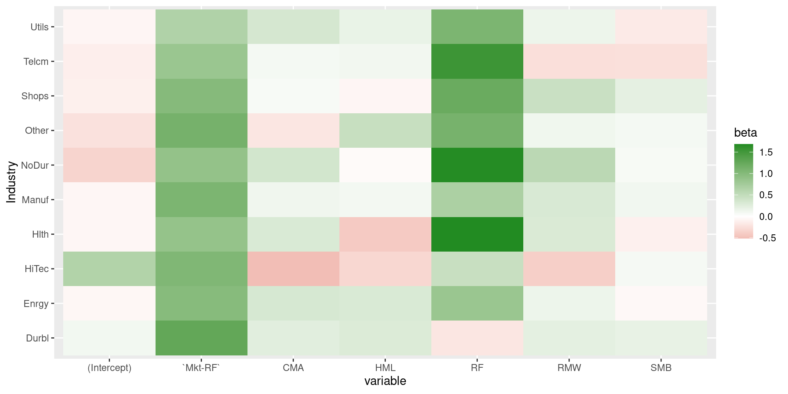
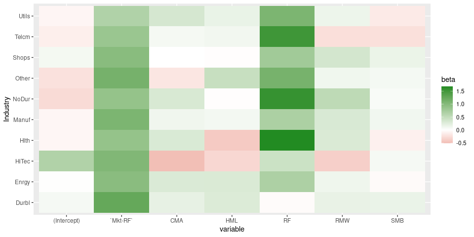
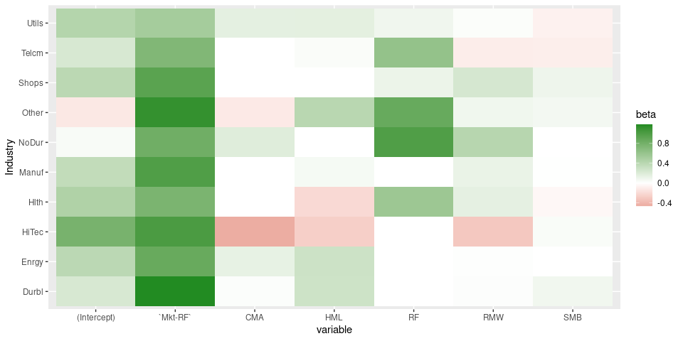

<!-- README.md is generated from README.Rmd. Please edit that file -->

# tidyfit

<!-- badges: start -->
<!-- badges: end -->


`tidyfit` is an `R`-package that facilitates and automates linear
regression and classification modeling in a tidy environment. The
package includes several methods, such as Lasso, PLS and ElasticNet
regressions, and can be augmented with custom methods. `tidyfit` builds
on the `tidymodels` suite, but emphasizes automated modeling with a
focus on the linear regression and classification coefficients, which
are the primary output of `tidyfit`.

## Installation

You can install the development version of tidyfit from
[GitHub](https://github.com/) with:

``` r
# install.packages("devtools")
devtools::install_github("jpfitzinger/tidyfit")
```

## Example

### Fama-French factor and industry data

`tidyfit` includes a data set of financial factor returns freely
available
[here](https://mba.tuck.dartmouth.edu/pages/faculty/ken.french/data_library.html).
The data set includes monthly industry returns for 10 industries, as
well as monthly factor returns for 5 factors:

``` r
library(tidyfit)
data <- tidyfit::Factor_Industry_Returns
```

### Fitting a linear regression

Models are fitted using `tidyfit::tidyfit`. Below a linear regression is
fitted using the `tidyfit::m.lm` wrapper. The date columns is masked and
the industry column is one-hot encoded:

``` r
fit <- data %>% 
  tidyfit(Return ~ ., lin_reg = m.lm, .mask = "Date")
fit
#> # A tibble: 16 × 4
#>    variable          beta model   model_info      
#>    <chr>            <dbl> <chr>   <list>          
#>  1 (Intercept)   -0.00408 lin_reg <tibble [1 × 4]>
#>  2 IndustryEnrgy -0.00409 lin_reg <tibble [1 × 4]>
#>  3 IndustryHiTec  0.0559  lin_reg <tibble [1 × 4]>
#>  4 IndustryHlth   0.0506  lin_reg <tibble [1 × 4]>
#>  5 IndustryManuf -0.0469  lin_reg <tibble [1 × 4]>
#>  6 IndustryNoDur  0.0171  lin_reg <tibble [1 × 4]>
#>  7 IndustryOther -0.0707  lin_reg <tibble [1 × 4]>
#>  8 IndustryShops  0.0405  lin_reg <tibble [1 × 4]>
#>  9 IndustryTelcm -0.184   lin_reg <tibble [1 × 4]>
#> 10 IndustryUtils -0.181   lin_reg <tibble [1 × 4]>
#> 11 CMA            0.117   lin_reg <tibble [1 × 4]>
#> 12 HML            0.0601  lin_reg <tibble [1 × 4]>
#> 13 `Mkt-RF`       0.977   lin_reg <tibble [1 × 4]>
#> 14 RF             1.01    lin_reg <tibble [1 × 4]>
#> 15 RMW            0.164   lin_reg <tibble [1 × 4]>
#> 16 SMB            0.0178  lin_reg <tibble [1 × 4]>
```

Detailed model and hyperparameter information is nested and can be
expanded:

``` r
fit %>% 
  unnest(model_info)
#> # A tibble: 16 × 7
#>    variable          beta model      s.e. `t value` `p value` R.squared
#>    <chr>            <dbl> <chr>     <dbl>     <dbl>     <dbl>     <dbl>
#>  1 (Intercept)   -0.00408 lin_reg 0.133     -0.0306  9.76e- 1     0.625
#>  2 IndustryEnrgy -0.00409 lin_reg 0.172     -0.0237  9.81e- 1     0.625
#>  3 IndustryHiTec  0.0559  lin_reg 0.172      0.325   7.45e- 1     0.625
#>  4 IndustryHlth   0.0506  lin_reg 0.172      0.294   7.69e- 1     0.625
#>  5 IndustryManuf -0.0469  lin_reg 0.172     -0.272   7.85e- 1     0.625
#>  6 IndustryNoDur  0.0171  lin_reg 0.172      0.0994  9.21e- 1     0.625
#>  7 IndustryOther -0.0707  lin_reg 0.172     -0.411   6.81e- 1     0.625
#>  8 IndustryShops  0.0405  lin_reg 0.172      0.235   8.14e- 1     0.625
#>  9 IndustryTelcm -0.184   lin_reg 0.172     -1.07    2.85e- 1     0.625
#> 10 IndustryUtils -0.181   lin_reg 0.172     -1.05    2.93e- 1     0.625
#> 11 CMA            0.117   lin_reg 0.0281     4.18    2.94e- 5     0.625
#> 12 HML            0.0601  lin_reg 0.0182     3.31    9.30e- 4     0.625
#> 13 `Mkt-RF`       0.977   lin_reg 0.00985   99.3     0            0.625
#> 14 RF             1.01    lin_reg 0.145      6.99    2.91e-12     0.625
#> 15 RMW            0.164   lin_reg 0.0191     8.56    1.41e-17     0.625
#> 16 SMB            0.0178  lin_reg 0.0140     1.27    2.03e- 1     0.625
```

Now, instead of fitting a single regression, we need to fit a regression
per industry. This is achieved simply by grouping:

``` r
fit <- data %>% 
  group_by(Industry) %>% 
  tidyfit(Return ~ ., lin_reg = m.lm, .mask = "Date")
```

Let’s plot the factor loadings in a heatmap:

``` r
fit %>% 
  ggplot(aes(variable, Industry)) +
  geom_tile(aes(fill = beta)) +
  scale_fill_gradient2(low = "firebrick", high = "forestgreen")
```



### Fitting a Lasso regression

Fitting a Lasso regression requires hyperparameter tuning for the
penalty `lambda`. This can be done by passing values to `.cv` and
`.cv_args`. Cross validation is performed using `rsample`. See
`?rsample::vfold_cv`, `?rsample::loo_cv` or `?rsample::rolling_origin`
for options that can be passed to `.cv_args`.

``` r
fit <- data %>% 
  group_by(Industry) %>% 
  tidyfit(Return ~ ., lasso_reg = m.lasso, .mask = "Date", 
          .cv = "vfold", .cv_args = list(v = 5))

fit %>% 
  ggplot(aes(variable, Industry)) +
  geom_tile(aes(fill = beta)) +
  scale_fill_gradient2(low = "firebrick", high = "forestgreen")
```



The results do not appear to be different from a linear regression. To
compare methods, simply pass multiple models:

``` r
fit <- data %>% 
  group_by(Industry) %>% 
  tidyfit(Return ~ ., lasso_reg = m.lasso, lin_reg = m.lm, .mask = "Date", 
          .cv = "vfold", .cv_args = list(v = 5))
```

Of course, a v-fold cross validation is not valid for ordered data.
Instead simply set a rolling cross validation:

``` r
fit <- data %>% 
  group_by(Industry) %>% 
  tidyfit(Return ~ ., lasso_reg = m.lasso, .mask = "Date", 
          .cv = "ts", .cv_args = list(initial = 60, assess = 24, skip = 24, cumulative = FALSE))

fit %>% 
  ggplot(aes(variable, Industry)) +
  geom_tile(aes(fill = beta)) +
  scale_fill_gradient2(low = "firebrick", high = "forestgreen")
```



### Predicting with an ElasticNet classifier

Let’s predict out-of-sample return probabilities:

``` r
data_train <- data %>% 
  mutate(Return = ifelse(Return > 0, 1, 0)) %>% 
  filter(Date <= 202112)

data_test <- data %>% 
  mutate(Return = ifelse(Return > 0, 1, 0)) %>% 
  filter(Date > 202112)
```

Classification is possible with `tidyfit` by passing
`family = "binomial"` to `.control`:

``` r
fit <- data_train %>% 
  mutate(Return = ifelse(Return > 0, 1, 0)) %>% 
  group_by(Industry) %>% 
  tidyfit(Return ~ ., enet_clf = m.enet, .mask = "Date", 
          .cv = "ts", .cv_args = list(initial = 60, assess = 24, skip = 24, cumulative = FALSE),
          .control = list(family = "binomial"))
```

Predictions can be made for all models using `tidypredict`:

``` r
pred <- fit %>% 
  tidypredict(data_test) %>% 
  mutate(Predicted = ifelse(pred > 0.5, 1, 0)) %>% 
  rename(Truth = Return)

# Print a confusion matrix
table(pred$Truth, pred$Predicted)
#>    
#>      0  1
#>   0  5 13
#>   1  0 12
```

### Additional functionality

`tidyfit` makes a few things a little easier:

-   Methods returned statistically comparable outputs. For instance, all
    covariates are standardized and the coefficients are
    back-transformed to the original scale. This is not done by all
    underlying packages (e.g. `pls`, which is used for the PCR and PLSR
    methods).
-   Hyperparameter grids are set to reasonable starting values. Custom
    grids can be passed to `.control`
    (e.g. `.control = list(lambda = c(seq(0, 1, by = 0.1)))`).
-   Hyperparameter can be tuned across all groups or separately within
    each group by setting the `.tune_each_group` flag.
-   Results for the individual slices can be returned using the
    `.return_slices` flag. This is particularly useful for rolling
    window estimation, which can be done by returning the results of a
    rolling cross validation.
