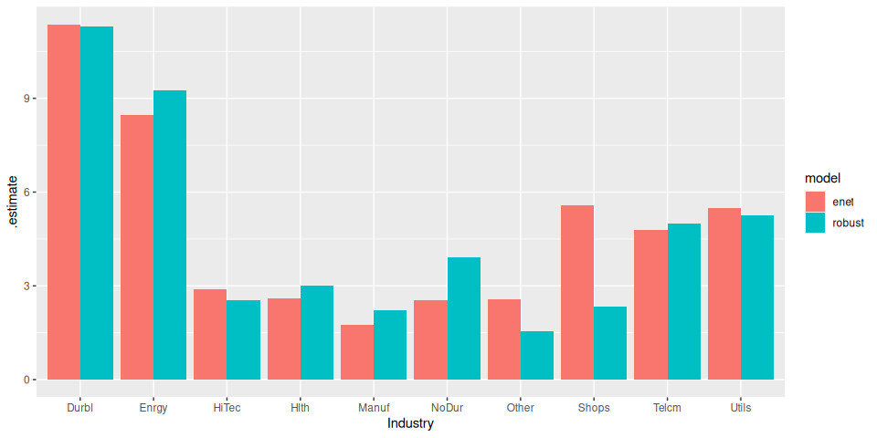

<!-- README.md is generated from README.Rmd. Please edit that file -->

# tidyfit 

<!-- badges: start -->


<!-- badges: end -->

`tidyfit` is an `R`-package that facilitates and automates linear and
nonlinear regression and classification modeling in a tidy environment.
The package includes methods such as the Lasso, PLS, time-varying
parameter or Bayesian model averaging regressions, and many more. The
aim is threefold:

1.  Offer a **standardized input-output interface** for a broad set of
    “good” modeling packages. Unlike projects such as `caret`, the aim
    is not to cover a comprehensive set of available packages, but
    rather a curated list of the most useful ones.
2.  Efficient **modeling with `tidy` data**, including verbs for
    regression and classification, automatic consideration of grouped
    data, and `tidy` output formats throughout.
3.  **Augment and automate** methods to ensure statistical comparability
    (e.g. across coefficients of different linear estimators), sensible
    default settings, necessary transformations (e.g. standardizing
    features when required), automatic hyperparameter optimization, etc.

`tidyfit` builds on the `tidymodels` suite, but emphasizes automated
modeling with a focus on grouped data, model comparisons, and
high-volume analytics. The objective is to make model fitting, cross
validation and model output very simple and standardized across all
methods, with many necessary method-specific transformations handled in
the background.

## Installation

`tidyfit` can be installed from CRAN or the development version from
[GitHub](https://github.com/jpfitzinger/tidyfit) with:

``` r
# CRAN
install.packages("tidyfit")

# Dev version
# install.packages("devtools")
devtools::install_github("jpfitzinger/tidyfit")

library(tidyfit)
```

## Overview and usage

`tidyfit` includes 3 deceptively simple functions:

- `regress()`
- `classify()`
- `m()`

All 3 of these functions return a `tidyfit.models` frame, which is a
data frame containing information about fitted regression and
classification models. `regress` and `classify` perform regression and
classification on tidy data. The functions ingest a `tibble`, prepare
input data for the models by splitting groups, partitioning cross
validation slices and handling any necessary adjustments and
transformations. The data is ultimately passed to the model wrapper
`m()` which fits the models.

[See the
flowchart](https://tidyfit.residualmetrics.com/articles/Flowchart.html)

To illustrate basic usage, suppose we would like to fit a financial
factor regression for 10 industries with exponential weighting,
comparing a WLS and a weighted LASSO regression:

``` r
progressr::handlers(global=TRUE)

tidyfit::Factor_Industry_Returns %>% 
  group_by(Industry) %>%                       # Ensures that a model is fitted for each industry
  mutate(Weight = 0.96^seq(n(), 1)) %>%        # Exponential weights
  
  # 'regress' allows flexible standardized regression analysis in a single line of code
  regress(
    Return ~ .,                                # Uses normal formula syntax
    m("lasso"),                                # LASSO regression wrapper, 'lambda' grid set to default
    m("lm"),                                   # OLS wrapper (can add as many wrappers as necessary here)
    .cv = "initial_time_split",                # Cross-validation method for optimal 'lambda' in LASSO
    .mask = "Date",                            # 'Date' columns should be excluded
    .weights = "Weight"                        # Specifies the weights column
  ) -> models_df

# Get coefficients frame
coef(models_df)
```

The syntax is identical for `classify`.

`m` is a powerful wrapper for many different regression and
classification techniques that can be used with `regress` and
`classify`, or as a stand-alone function:

``` r
m(
  <method>,           # e.g. "lm" or "lasso"
  formula, data,      # not passed when used within regress or classify
  ...                 # Args passed to underlying method, e.g. to stats::lm for OLS regression
)
```

An important feature of `m()` is that all arguments can be passed as
vectors, allowing generalized hyperparameter tuning or scenario analysis
for any method:

- Passing a hyperparameter grid:
  `m("lasso", lambda = seq(0, 1, by = 0.1))`
- Different algorithms for robust regression:
  `m("robust", method = c("M", "MM"))`
- Forward vs. backward selection:
  `m("subset", method = c("forward", "backward"))`
- Logit vs. Probit models:
  `m("glm", family = list(binomial(link="logit"), binomial(link="probit")))`

Arguments that are meant to be vectors (e.g. weights) are recognized by
the function and not interpreted as grids.

## Methods implemented in `tidyfit`

`tidyfit` currently implements the following methods:

<table class="table table-striped" style="margin-left: auto; margin-right: auto;">
<thead>
<tr>
<th style="text-align:left;">
Method
</th>
<th style="text-align:center;">
Name
</th>
<th style="text-align:center;">
Package
</th>
<th style="text-align:center;">
Regression
</th>
<th style="text-align:center;">
Classification
</th>
</tr>
</thead>
<tbody>
<tr grouplength="4">
<td colspan="5" style="border-bottom: 1px solid;">
<strong>Linear (generalized) regression or classification</strong>
</td>
</tr>
<tr>
<td style="text-align:left;padding-left: 2em;" indentlevel="1">
OLS
</td>
<td style="text-align:center;">
lm
</td>
<td style="text-align:center;">
`stats`
</td>
<td style="text-align:center;">
yes
</td>
<td style="text-align:center;">
no
</td>
</tr>
<tr>
<td style="text-align:left;padding-left: 2em;" indentlevel="1">
GLS
</td>
<td style="text-align:center;">
glm
</td>
<td style="text-align:center;">
`stats`
</td>
<td style="text-align:center;">
yes
</td>
<td style="text-align:center;">
yes
</td>
</tr>
<tr>
<td style="text-align:left;padding-left: 2em;" indentlevel="1">
Robust regression (e.g. Huber loss)
</td>
<td style="text-align:center;">
robust
</td>
<td style="text-align:center;">
`MASS`
</td>
<td style="text-align:center;">
yes
</td>
<td style="text-align:center;">
no
</td>
</tr>
<tr>
<td style="text-align:left;padding-left: 2em;" indentlevel="1">
Quantile regression
</td>
<td style="text-align:center;">
quantile
</td>
<td style="text-align:center;">
`quantreg`
</td>
<td style="text-align:center;">
yes
</td>
<td style="text-align:center;">
no
</td>
</tr>
<tr grouplength="4">
<td colspan="5" style="border-bottom: 1px solid;">
<strong>Regression or classification with L1 and L2 penalties</strong>
</td>
</tr>
<tr>
<td style="text-align:left;padding-left: 2em;" indentlevel="1">
LASSO
</td>
<td style="text-align:center;">
lasso
</td>
<td style="text-align:center;">
`glmnet`
</td>
<td style="text-align:center;">
yes
</td>
<td style="text-align:center;">
yes
</td>
</tr>
<tr>
<td style="text-align:left;padding-left: 2em;" indentlevel="1">
Ridge
</td>
<td style="text-align:center;">
ridge
</td>
<td style="text-align:center;">
`glmnet`
</td>
<td style="text-align:center;">
yes
</td>
<td style="text-align:center;">
yes
</td>
</tr>
<tr>
<td style="text-align:left;padding-left: 2em;" indentlevel="1">
Adaptive LASSO
</td>
<td style="text-align:center;">
adalasso
</td>
<td style="text-align:center;">
`glmnet`
</td>
<td style="text-align:center;">
yes
</td>
<td style="text-align:center;">
yes
</td>
</tr>
<tr>
<td style="text-align:left;padding-left: 2em;" indentlevel="1">
ElasticNet
</td>
<td style="text-align:center;">
enet
</td>
<td style="text-align:center;">
`glmnet`
</td>
<td style="text-align:center;">
yes
</td>
<td style="text-align:center;">
yes
</td>
</tr>
<tr grouplength="3">
<td colspan="5" style="border-bottom: 1px solid;">
<strong>Machine Learning</strong>
</td>
</tr>
<tr>
<td style="text-align:left;padding-left: 2em;" indentlevel="1">
Gradient boosting regression
</td>
<td style="text-align:center;">
boost
</td>
<td style="text-align:center;">
`mboost`
</td>
<td style="text-align:center;">
yes
</td>
<td style="text-align:center;">
yes
</td>
</tr>
<tr>
<td style="text-align:left;padding-left: 2em;" indentlevel="1">
Support vector machine
</td>
<td style="text-align:center;">
svm
</td>
<td style="text-align:center;">
`e1071`
</td>
<td style="text-align:center;">
yes
</td>
<td style="text-align:center;">
yes
</td>
</tr>
<tr>
<td style="text-align:left;padding-left: 2em;" indentlevel="1">
Random forest
</td>
<td style="text-align:center;">
rf
</td>
<td style="text-align:center;">
`randomForest`
</td>
<td style="text-align:center;">
yes
</td>
<td style="text-align:center;">
yes
</td>
</tr>
<tr grouplength="3">
<td colspan="5" style="border-bottom: 1px solid;">
<strong>Factor regressions</strong>
</td>
</tr>
<tr>
<td style="text-align:left;padding-left: 2em;" indentlevel="1">
Principal components regression
</td>
<td style="text-align:center;">
pcr
</td>
<td style="text-align:center;">
`pls`
</td>
<td style="text-align:center;">
yes
</td>
<td style="text-align:center;">
no
</td>
</tr>
<tr>
<td style="text-align:left;padding-left: 2em;" indentlevel="1">
Partial least squares
</td>
<td style="text-align:center;">
plsr
</td>
<td style="text-align:center;">
`pls`
</td>
<td style="text-align:center;">
yes
</td>
<td style="text-align:center;">
no
</td>
</tr>
<tr>
<td style="text-align:left;padding-left: 2em;" indentlevel="1">
Hierarchical feature regression
</td>
<td style="text-align:center;">
hfr
</td>
<td style="text-align:center;">
`hfr`
</td>
<td style="text-align:center;">
yes
</td>
<td style="text-align:center;">
no
</td>
</tr>
<tr grouplength="3">
<td colspan="5" style="border-bottom: 1px solid;">
<strong>Subset selection</strong>
</td>
</tr>
<tr>
<td style="text-align:left;padding-left: 2em;" indentlevel="1">
Best subset selection
</td>
<td style="text-align:center;">
subset
</td>
<td style="text-align:center;">
`bestglm`
</td>
<td style="text-align:center;">
yes
</td>
<td style="text-align:center;">
yes
</td>
</tr>
<tr>
<td style="text-align:left;padding-left: 2em;" indentlevel="1">
Genetic Algorithm
</td>
<td style="text-align:center;">
genetic
</td>
<td style="text-align:center;">
`gaselect`
</td>
<td style="text-align:center;">
yes
</td>
<td style="text-align:center;">
no
</td>
</tr>
<tr>
<td style="text-align:left;padding-left: 2em;" indentlevel="1">
General-to-specific
</td>
<td style="text-align:center;">
gets
</td>
<td style="text-align:center;">
`gets`
</td>
<td style="text-align:center;">
yes
</td>
<td style="text-align:center;">
no
</td>
</tr>
<tr grouplength="6">
<td colspan="5" style="border-bottom: 1px solid;">
<strong>Bayesian regression</strong>
</td>
</tr>
<tr>
<td style="text-align:left;padding-left: 2em;" indentlevel="1">
Bayesian regression
</td>
<td style="text-align:center;">
bayes
</td>
<td style="text-align:center;">
`arm`
</td>
<td style="text-align:center;">
yes
</td>
<td style="text-align:center;">
yes
</td>
</tr>
<tr>
<td style="text-align:left;padding-left: 2em;" indentlevel="1">
Bayesian Ridge
</td>
<td style="text-align:center;">
bridge
</td>
<td style="text-align:center;">
`monomvn`
</td>
<td style="text-align:center;">
yes
</td>
<td style="text-align:center;">
no
</td>
</tr>
<tr>
<td style="text-align:left;padding-left: 2em;" indentlevel="1">
Bayesian Lasso
</td>
<td style="text-align:center;">
blasso
</td>
<td style="text-align:center;">
`monomvn`
</td>
<td style="text-align:center;">
yes
</td>
<td style="text-align:center;">
no
</td>
</tr>
<tr>
<td style="text-align:left;padding-left: 2em;" indentlevel="1">
Bayesian model averaging
</td>
<td style="text-align:center;">
bma
</td>
<td style="text-align:center;">
`BMS`
</td>
<td style="text-align:center;">
yes
</td>
<td style="text-align:center;">
no
</td>
</tr>
<tr>
<td style="text-align:left;padding-left: 2em;" indentlevel="1">
Bayesian Spike and Slab
</td>
<td style="text-align:center;">
spikeslab
</td>
<td style="text-align:center;">
`BoomSpikeSlab`
</td>
<td style="text-align:center;">
yes
</td>
<td style="text-align:center;">
yes
</td>
</tr>
<tr>
<td style="text-align:left;padding-left: 2em;" indentlevel="1">
Bayesian time-varying parameters regression
</td>
<td style="text-align:center;">
tvp
</td>
<td style="text-align:center;">
`shrinkTVP`
</td>
<td style="text-align:center;">
yes
</td>
<td style="text-align:center;">
no
</td>
</tr>
<tr grouplength="1">
<td colspan="5" style="border-bottom: 1px solid;">
<strong>Mixed-effects modeling</strong>
</td>
</tr>
<tr>
<td style="text-align:left;padding-left: 2em;" indentlevel="1">
Generalized mixed-effects regression
</td>
<td style="text-align:center;">
glmm
</td>
<td style="text-align:center;">
`lme4`
</td>
<td style="text-align:center;">
yes
</td>
<td style="text-align:center;">
yes
</td>
</tr>
<tr grouplength="1">
<td colspan="5" style="border-bottom: 1px solid;">
<strong>Specialized time series methods</strong>
</td>
</tr>
<tr>
<td style="text-align:left;padding-left: 2em;" indentlevel="1">
Markov-switching regression
</td>
<td style="text-align:center;">
mslm
</td>
<td style="text-align:center;">
`MSwM`
</td>
<td style="text-align:center;">
yes
</td>
<td style="text-align:center;">
no
</td>
</tr>
<tr grouplength="4">
<td colspan="5" style="border-bottom: 1px solid;">
<strong>Feature selection</strong>
</td>
</tr>
<tr>
<td style="text-align:left;padding-left: 2em;" indentlevel="1">
Pearson correlation
</td>
<td style="text-align:center;">
cor
</td>
<td style="text-align:center;">
`stats`
</td>
<td style="text-align:center;">
yes
</td>
<td style="text-align:center;">
no
</td>
</tr>
<tr>
<td style="text-align:left;padding-left: 2em;" indentlevel="1">
Chi-squared test
</td>
<td style="text-align:center;">
chisq
</td>
<td style="text-align:center;">
`stats`
</td>
<td style="text-align:center;">
no
</td>
<td style="text-align:center;">
yes
</td>
</tr>
<tr>
<td style="text-align:left;padding-left: 2em;" indentlevel="1">
Minimum redundancy, maximum relevance
</td>
<td style="text-align:center;">
mrmr
</td>
<td style="text-align:center;">
`mRMRe`
</td>
<td style="text-align:center;">
yes
</td>
<td style="text-align:center;">
yes
</td>
</tr>
<tr>
<td style="text-align:left;padding-left: 2em;" indentlevel="1">
ReliefF
</td>
<td style="text-align:center;">
relief
</td>
<td style="text-align:center;">
`CORElearn`
</td>
<td style="text-align:center;">
yes
</td>
<td style="text-align:center;">
yes
</td>
</tr>
</tbody>
</table>

See `?m` for additional information.

It is important to note that the above list is not complete, since some
of the methods encompass multiple algorithms. For instance, “subset” can
be used to perform forward, backward or exhaustive search selection
using `leaps`. Similarly, “lasso” includes certain grouped LASSO
implementations that can be fitted with `glmnet`.

## A minimal workflow

In this section, a minimal workflow is used to demonstrate how the
package works. For more detailed guides of specialized topics, or simply
for further reading, follow these links:

- [The
  flowchart](https://tidyfit.residualmetrics.com/articles/Flowchart.html)
- [Regularized
  regression](https://tidyfit.residualmetrics.com/articles/Predicting_Boston_House_Prices.html)
  (Boston house price data)
- [Multinomial
  classification](https://tidyfit.residualmetrics.com/articles/Multinomial_Classification.html)
  (iris data)
- [Feature
  Selection](https://tidyfit.residualmetrics.com/articles/Feature_Selection.html)
  (macroeconomic data)
- [Accessing fitted
  models](https://tidyfit.residualmetrics.com/articles/Accessing_Fitted_Model_Objects.html)
- [Rolling window regression for time
  series](https://tidyfit.residualmetrics.com/articles/Rolling_Window_Time_Series_Regression.html)
  (factor data)
- [Time-varying
  parameters](https://tidyfit.residualmetrics.com/articles/Time-varying_parameters_vs_rolling_windows.html)
  (factor data)
- [Bootstrap confidence
  intervals](https://tidyfit.residualmetrics.com/articles/Bootstrapping_Confidence_Intervals.html)

`tidyfit` includes a data set of financial Fama-French factor returns
freely available
[here](https://mba.tuck.dartmouth.edu/pages/faculty/ken.french/data_library.html).
The data set includes monthly industry returns for 10 industries, as
well as monthly factor returns for 5 factors:

``` r
data <- tidyfit::Factor_Industry_Returns

# Calculate excess return
data <- data %>% 
  mutate(Return = Return - RF) %>% 
  select(-RF)

data
#> # A tibble: 7,080 × 8
#>      Date Industry Return `Mkt-RF`   SMB   HML   RMW   CMA
#>     <dbl> <chr>     <dbl>    <dbl> <dbl> <dbl> <dbl> <dbl>
#>  1 196307 NoDur     -0.76    -0.39 -0.44 -0.89  0.68 -1.23
#>  2 196308 NoDur      4.64     5.07 -0.75  1.68  0.36 -0.34
#>  3 196309 NoDur     -1.96    -1.57 -0.55  0.08 -0.71  0.29
#>  4 196310 NoDur      2.36     2.53 -1.37 -0.14  2.8  -2.02
#>  5 196311 NoDur     -1.4     -0.85 -0.89  1.81 -0.51  2.31
#>  6 196312 NoDur      2.52     1.83 -2.07 -0.08  0.03 -0.04
#>  7 196401 NoDur      0.49     2.24  0.11  1.47  0.17  1.51
#>  8 196402 NoDur      1.61     1.54  0.3   2.74 -0.05  0.9 
#>  9 196403 NoDur      2.77     1.41  1.36  3.36 -2.21  3.19
#> 10 196404 NoDur     -0.77     0.1  -1.59 -0.58 -1.27 -1.04
#> # ℹ 7,070 more rows
```

We will only use a subset of the data to keep things simple:

``` r
df_train <- data %>% 
  filter(Date > 201800 & Date < 202000)
df_test <- data %>% 
  filter(Date >= 202000)
```

Before beginning with the estimation, we can activate the progress bar
visualization. This allows us to gauge estimation progress along the
way. `tidyfit` uses the `progressr`-package internally to generate a
progress bar — run `progressr::handlers(global=TRUE)` to activate
progress bars in your environment.

For purposes of this demonstration, the objective will be to fit an
ElasticNet regression for each industry group, and compare results to a
robust least squares regression. This can be done with `regress` after
grouping the data. For grouped data, the functions `regress` and
`classify` estimate models for each group independently:

``` r
model_frame <- df_train %>% 
  group_by(Industry) %>% 
  regress(Return ~ ., 
          m("enet"), 
          m("robust", method = "MM", psi = MASS::psi.huber), 
          .cv = "initial_time_split", .mask = "Date")
```

Note that the penalty and mixing parameters are chosen automatically
using a time series train/test split (`rsample::initial_time_split`),
with a hyperparameter grid set by the package `dials`. See `?regress`
for additional CV methods. A custom grid can easily be passed using
`lambda = c(...)` and/or `alpha = c(...)` in the `m("enet")` wrapper.

The resulting `tidyfit.models` frame consists of 3 components:

1.  A group of identifying columns. This includes the `Industry` column,
    the model name, and grid ID (the ID for the model settings used).
2.  `estimator_fct`, `size (MB)` and `model_object` columns. These
    columns contain information on the model itself. The `model_object`
    is the fitted `tidyFit` model (an `R6` class that contains the model
    object as well as any additional information needed to perform
    predictions or access coefficients)
3.  Nested `settings`, as well as (if applicable) `messages` and
    `warnings`.

``` r
subset_mod_frame <- model_frame %>% 
  filter(Industry %in% unique(Industry)[1:2])
subset_mod_frame
#> # A tibble: 4 × 8
#>   Industry model  estimator_fct  `size (MB)` grid_id  model_object settings
#>   <chr>    <chr>  <chr>                <dbl> <chr>    <list>       <list>  
#> 1 Enrgy    enet   glmnet::glmnet      1.21   #001|100 <tidyFit>    <tibble>
#> 2 Shops    enet   glmnet::glmnet      1.21   #001|049 <tidyFit>    <tibble>
#> 3 Enrgy    robust MASS::rlm           0.0639 #0010000 <tidyFit>    <tibble>
#> 4 Shops    robust MASS::rlm           0.0638 #0010000 <tidyFit>    <tibble>
#> # ℹ 1 more variable: warnings <chr>
```

Let’s unnest the settings columns:

``` r
subset_mod_frame %>% 
  tidyr::unnest(settings, keep_empty = TRUE)
#> # A tibble: 4 × 13
#>   Industry model  estimator_fct  `size (MB)` grid_id  model_object alpha weights
#>   <chr>    <chr>  <chr>                <dbl> <chr>    <list>       <dbl> <list> 
#> 1 Enrgy    enet   glmnet::glmnet      1.21   #001|100 <tidyFit>        0 <NULL> 
#> 2 Shops    enet   glmnet::glmnet      1.21   #001|049 <tidyFit>        0 <NULL> 
#> 3 Enrgy    robust MASS::rlm           0.0639 #0010000 <tidyFit>       NA <NULL> 
#> 4 Shops    robust MASS::rlm           0.0638 #0010000 <tidyFit>       NA <NULL> 
#> # ℹ 5 more variables: family <chr>, lambda <dbl>, method <chr>, psi <list>,
#> #   warnings <chr>
```

The `tidyfit.models` frame can be used to access additional information.
Specifically, we can do 4 things:

1.  Access the fitted model
2.  Predict
3.  Access a data frame of estimated parameters
4.  Use additional generics

The **fitted tidyFit models** are stored as an `R6` class in the
`model_object` column and can be addressed directly with generics such
as `coef` or `summary`. The underlying object (e.g. an `lm` class fitted
model) is given in `...$object` (see
[here](https://tidyfit.residualmetrics.com/articles/Accessing_Fitted_Model_Objects.html)
for another example):

``` r
subset_mod_frame %>% 
  mutate(fitted_model = map(model_object, ~.$object))
#> # A tibble: 4 × 9
#>   Industry model  estimator_fct  `size (MB)` grid_id  model_object settings
#>   <chr>    <chr>  <chr>                <dbl> <chr>    <list>       <list>  
#> 1 Enrgy    enet   glmnet::glmnet      1.21   #001|100 <tidyFit>    <tibble>
#> 2 Shops    enet   glmnet::glmnet      1.21   #001|049 <tidyFit>    <tibble>
#> 3 Enrgy    robust MASS::rlm           0.0639 #0010000 <tidyFit>    <tibble>
#> 4 Shops    robust MASS::rlm           0.0638 #0010000 <tidyFit>    <tibble>
#> # ℹ 2 more variables: warnings <chr>, fitted_model <list>
```

To **predict**, we need data with the same columns as the input data and
simply use the generic `predict` function. Groups are respected and if
the response variable is in the data, it is included as a `truth` column
in the resulting object:

``` r
predict(subset_mod_frame, data)
#> # A tibble: 2,832 × 4
#> # Groups:   Industry, model [4]
#>    Industry model prediction truth
#>    <chr>    <chr>      <dbl> <dbl>
#>  1 Enrgy    enet      -3.77   2.02
#>  2 Enrgy    enet       3.90   3.69
#>  3 Enrgy    enet      -2.40  -3.91
#>  4 Enrgy    enet      -3.30  -0.61
#>  5 Enrgy    enet       0.762 -1.43
#>  6 Enrgy    enet      -0.293  4.36
#>  7 Enrgy    enet       3.68   4.54
#>  8 Enrgy    enet       2.31   0.8 
#>  9 Enrgy    enet       7.26   1.09
#> 10 Enrgy    enet      -2.53   3.74
#> # ℹ 2,822 more rows
```

Finally, we can obtain a **tidy frame of the coefficients** using the
generic `coef` function:

``` r
estimates <- coef(subset_mod_frame)
estimates
#> # A tibble: 24 × 5
#> # Groups:   Industry, model [4]
#>    Industry model term        estimate model_info      
#>    <chr>    <chr> <chr>          <dbl> <list>          
#>  1 Enrgy    enet  (Intercept) -0.955   <tibble [1 × 4]>
#>  2 Enrgy    enet  Mkt-RF       1.20    <tibble [1 × 4]>
#>  3 Enrgy    enet  SMB          0.703   <tibble [1 × 4]>
#>  4 Enrgy    enet  HML         -0.00208 <tibble [1 × 4]>
#>  5 Enrgy    enet  RMW         -0.622   <tibble [1 × 4]>
#>  6 Enrgy    enet  CMA          1.32    <tibble [1 × 4]>
#>  7 Shops    enet  (Intercept)  1.03    <tibble [1 × 4]>
#>  8 Shops    enet  Mkt-RF       0.0849  <tibble [1 × 4]>
#>  9 Shops    enet  SMB          0.0353  <tibble [1 × 4]>
#> 10 Shops    enet  HML         -0.0149  <tibble [1 × 4]>
#> # ℹ 14 more rows
```

The estimates contain additional method-specific information that is
nested in `model_info`. This can include standard errors, t-values and
similar information:

``` r
tidyr::unnest(estimates, model_info)
#> # A tibble: 24 × 8
#> # Groups:   Industry, model [4]
#>    Industry model term        estimate lambda dev.ratio std.error statistic
#>    <chr>    <chr> <chr>          <dbl>  <dbl>     <dbl>     <dbl>     <dbl>
#>  1 Enrgy    enet  (Intercept) -0.955    0.536     0.812        NA        NA
#>  2 Enrgy    enet  Mkt-RF       1.20     0.536     0.812        NA        NA
#>  3 Enrgy    enet  SMB          0.703    0.536     0.812        NA        NA
#>  4 Enrgy    enet  HML         -0.00208  0.536     0.812        NA        NA
#>  5 Enrgy    enet  RMW         -0.622    0.536     0.812        NA        NA
#>  6 Enrgy    enet  CMA          1.32     0.536     0.812        NA        NA
#>  7 Shops    enet  (Intercept)  1.03    50.1       0.173        NA        NA
#>  8 Shops    enet  Mkt-RF       0.0849  50.1       0.173        NA        NA
#>  9 Shops    enet  SMB          0.0353  50.1       0.173        NA        NA
#> 10 Shops    enet  HML         -0.0149  50.1       0.173        NA        NA
#> # ℹ 14 more rows
```

Additional generics such as `fitted` or `resid` can be used to obtain
more information on the models.

Suppose we would like to evaluate the relative performance of the two
methods. This becomes exceedingly simple using the `yardstick` package:

``` r
model_frame %>% 
  # Generate predictions
  predict(df_test) %>% 
  # Calculate RMSE
  yardstick::rmse(truth, prediction) %>% 
  # Plot
  ggplot(aes(Industry, .estimate)) +
  geom_col(aes(fill = model), position = position_dodge())
```



The ElasticNet performs a little better (unsurprising really, given the
small data set).

A **more detailed regression analysis of Boston house price data** using
a panel of regularized regression estimators can be found
[here](https://tidyfit.residualmetrics.com/articles/Predicting_Boston_House_Prices.html).
