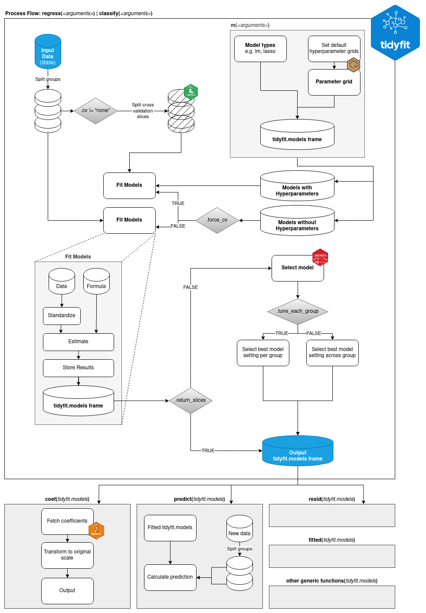

```{r, include = FALSE}
knitr::opts_chunk$set(
  collapse = TRUE,
  comment = "#>",
  echo = TRUE,
  message = FALSE,
  warning = FALSE
)
```

The following flowchart illustrates how `tidyfit` processes data and fits models:


